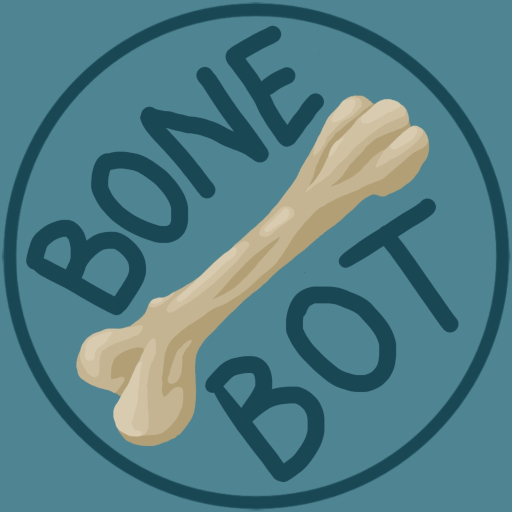

<div align="center">
  
</div>
<!-- Of course centering sucks, it's based on HTML...-->

# Bone Bot
The 'bone head' <!-- I don't know if I should laugh or barf...-->
bot for the Dogghouse Discord server.

## Commands

### Bone Sus
Convert the passed in image to be full of
twerking crew mates from the hit game 'Among Us'

`width`: The number of crew mates to put across the resulting image

```
/bone-sus image [width]
```
### Bone Teams:
Randomly rolls teams based on who is present
in a voice channel.

Generates team names from the 'insults' lists

If more members are present then what may be placed
into a team, they will be placed in an additional
team tagged 'Extras'

`channel`: The voice channel to pull participants from

`team-count`: The number of teams to generate (default: 2)

`team-size`: The size of team to generate (default: # of members / `team-count`)

```
/bone-teams channel channel [team-count] [team-size]
```

## Deployment

### Build `rusty-sussy`
```shell
cd rusty-sussy
cargo build --release
cd ..
```

### Build the Docker image
```shell
docker buildx build --tag bone-bot .
```

### Deploy with docker-compose
```shell
docker-compose up
```

## Development
### Requirements
* Python 3.13
* (Optional) Rust (for `bone-sus`) uses [rusty-sussy](https://github.com/The-Dogghouse/rusty-sussy)
  * Gifski: https://gif.ski/
* An API Key from Discord
* [black](https://github.com/psf/black)

### Cloning
You'll need to do a recursive clone since we've got a submodule
```shell
git clone --recursive git@github.com:The-Dogghouse/bone-bot.git
```

If you forgot to do this you'll be missing rusty-sussy, and you'll
be forced to actually read the README for how to do this.

If you need the submodule after you cloned, run the following
in the root of the project:
```shell
git submodule init
git submodule update
```

### rusty-sussy
To enable the `bone-sus` command, you'll need to
build `rusty-sussy`.

`cd` into the `rusty-sussy/` directory
```shell
cd rusty-sussy/
```

Build the release version with `cargo`
```shell
cargo build --release
```

### Style
Run [black](https://github.com/psf/black) on it and don't think about it
```shell
black *.py
```

### Tests
```shell
python test.py
```
